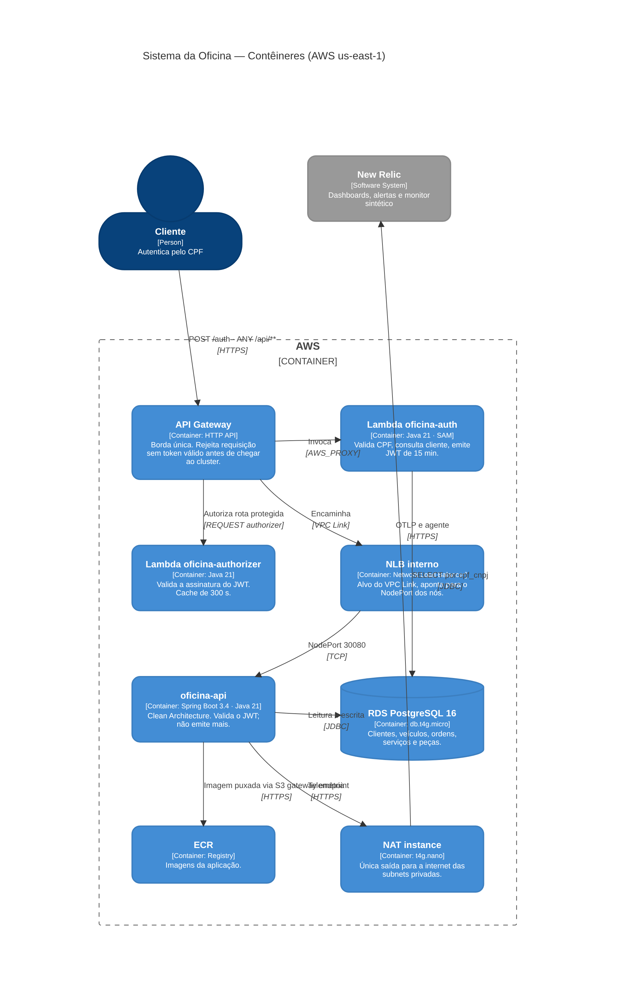

# oficina-api

Aplicação backend do sistema de gestão de ordens de serviço de uma oficina mecânica, desenvolvida no Tech Challenge da PosTech FIAP (Arquitetura de Software).

Este repositório contém a aplicação Spring Boot. Infraestrutura e autenticação estão em repositórios próprios, conforme a organização exigida na Fase 3.

[](https://sonarcloud.io/summary/new_code?id=Guilherme-Fumagali_tech-challenge-1)
[](https://sonarcloud.io/summary/new_code?id=Guilherme-Fumagali_tech-challenge-1)
[](https://sonarcloud.io/summary/new_code?id=Guilherme-Fumagali_tech-challenge-1)

## Repositórios do projeto

| Repositório | Conteúdo |
|---|---|
| [tech-challenge-1](https://github.com/Guilherme-Fumagali/tech-challenge-1) | Aplicação (este repositório) |
| [oficina-auth-lambda](https://github.com/Guilherme-Fumagali/oficina-auth-lambda) | Função serverless de autenticação por CPF |
| [oficina-infra-k8s](https://github.com/Guilherme-Fumagali/oficina-infra-k8s) | Rede, EKS, ECR, API Gateway e New Relic (Terraform) |
| [oficina-infra-db](https://github.com/Guilherme-Fumagali/oficina-infra-db) | RDS PostgreSQL (Terraform) |

## Links

| Artefato | Local |
|---|---|
| Contrato OpenAPI | [`docs/openapi.json`](docs/openapi.json), visualizável no [Swagger Editor](https://editor.swagger.io/?url=https://raw.githubusercontent.com/Guilherme-Fumagali/tech-challenge-1/main/docs/openapi.json) |
| Swagger UI | `http://localhost:8080/swagger-ui.html` na execução local |
| Coleção de requisições | [`docs/demo.http`](docs/demo.http) (formato HTTP Client, compatível com IntelliJ e VS Code REST Client) |
| Carga de dados de demonstração | [`scripts/preparar-demo.sh`](scripts/preparar-demo.sh): cadastra cliente, veículo e catálogo e cria ordens de serviço em todos os status, via API Gateway. Uso: `CPF_FUNCIONARIO=... ./scripts/preparar-demo.sh` (requer `curl`, `jq` e credenciais AWS para ler a URL do SSM, ou `API_URL`) |
| Documentação de arquitetura | [`docs/tech-challenge-3`](docs/tech-challenge-3): RFCs, ADRs, diagramas e débitos técnicos |
| Testes | [`docs/testes.md`](docs/testes.md) |
| Runbooks dos alertas | [`docs/runbooks`](docs/runbooks) |
| Vídeo de demonstração | a publicar |

## Arquitetura

A aplicação roda no EKS, em subnets privadas, atrás do API Gateway. O gateway autentica as rotas protegidas com um Lambda authorizer e encaminha as requisições por VPC Link e Network Load Balancer. A aplicação valida novamente o JWT, persiste no RDS PostgreSQL e envia telemetria ao New Relic.



Internamente, o código segue Clean Architecture:

```
src/main/java/com/oficina/mecanica/
├── domain/          entidades, value objects, exceções e portas de repositório (sem dependência de framework)
├── application/     casos de uso
└── infrastructure/  Spring Boot, JPA, REST, segurança, notificação e métricas
```

Diagramas completos: [contexto](docs/tech-challenge-3/diagramas/c1-contexto.md), [contêineres](docs/tech-challenge-3/diagramas/c2-containers.md), [componentes](docs/tech-challenge-3/diagramas/c3-componentes.md), [sequência de autenticação](docs/tech-challenge-3/diagramas/sequencia-autenticacao.md), [sequência de abertura de OS](docs/tech-challenge-3/diagramas/sequencia-abertura-os.md) e [modelo relacional](docs/tech-challenge-3/diagramas/der-modelo-relacional.md).

## Tecnologias

| Área | Tecnologia |
|---|---|
| Linguagem e framework | Java 21, Spring Boot 3.4 |
| Persistência | PostgreSQL 16, Spring Data JPA, Flyway, MapStruct |
| Segurança | Spring Security, JJWT 0.12 (validação de JWT HMAC) |
| Documentação da API | SpringDoc OpenAPI (Swagger UI) |
| Observabilidade | agente Java do New Relic, Micrometer com OTLP, logs estruturados em formato ECS |
| Testes | JUnit 5, Mockito, AssertJ, Testcontainers, JaCoCo |
| Build e implantação | Maven, Docker, GitHub Actions, Amazon ECR, Amazon EKS |

## Execução local

Pré-requisitos: Docker e Docker Compose, com as portas `8080`, `5432`, `1025` e `8025` livres.

```bash
cp .env.example .env
docker compose up --build
```

| Serviço | Endereço |
|---|---|
| API | `http://localhost:8080` |
| Swagger UI | `http://localhost:8080/swagger-ui.html` |
| MailHog (e-mails enviados, com os links de aprovação) | `http://localhost:8025` |

Sem Docker, com um PostgreSQL local já criado:

```bash
./mvnw spring-boot:run -Dspring-boot.run.arguments="--DB_URL=jdbc:postgresql://localhost:5432/oficina --DB_USER=oficina --DB_PASS=oficina --JWT_SECRET=chave-local-com-pelo-menos-32-caracteres"
```

### Variáveis de ambiente

| Variável | Padrão | Descrição |
|---|---|---|
| `DB_URL` | `jdbc:postgresql://localhost:5432/oficina` | URL do banco |
| `DB_USER` / `DB_PASS` | `oficina` | Credenciais do banco |
| `JWT_SECRET` | valor de desenvolvimento | Chave HMAC usada para validar os tokens; deve ser a mesma da Lambda de autenticação |
| `NOTIFICACAO_CANAL` | `log` | `smtp` envia e-mail; `log` apenas registra (uso em desenvolvimento) |
| `FUNCIONARIO_SEED_CPF` | — | CPF do funcionário cadastrado pela migration `V9`; definido apenas em homologação |
| `APROVACAO_TOKEN_VALIDADE_HORAS` | `168` | Validade do token de aprovação externa |
| `ENV` | `local` | Ambiente, usado como tag nas métricas |
| `SPRING_PROFILES_ACTIVE` | — | `k8s` ativa o log estruturado em JSON |
| `NEW_RELIC_LICENSE_KEY` | — | Ativa o agente de APM |
| `OTEL_EXPORTER_OTLP_METRICS_ENDPOINT` | `http://localhost:4318/v1/metrics` | Destino das métricas de negócio |

## Implantação

A implantação é feita pelo pipeline, nos ambientes definidos na [ADR-012](docs/tech-challenge-3/adrs/ADR-012-ambientes-segregados.md):

| Branch | Ambiente | Cluster | Aprovação |
|---|---|---|---|
| `develop` | homologação | `oficina-api-staging` | não |
| `main` | produção | `oficina-api-prod` | sim, no GitHub Environment `prod` |

Os ambientes são segregados, com cluster, banco, ECR, parâmetros e segredos próprios. O cluster e o banco são provisionados pelos repositórios de infraestrutura; a ordem de provisionamento está no README do [oficina-infra-k8s](https://github.com/Guilherme-Fumagali/oficina-infra-k8s).

## CI/CD

Workflow: [`.github/workflows/ci-cd.yml`](.github/workflows/ci-cd.yml).

| Job | Quando executa | O que faz |
|---|---|---|
| Build & Test | todo push, em qualquer branch | `mvn -B verify`: compila, executa **todos os testes** (unitários e de integração com Testcontainers), confere o contrato `docs/openapi.json`, aplica os limites mínimos de cobertura do JaCoCo e publica o relatório |
| SonarCloud | push na `main` | análise estática, cobertura e quality gate |
| Build & push no ECR | push em `develop` ou `main`, após os testes | constrói a imagem Docker e publica no ECR do ambiente; se o ECR não existir, o job é concluído com aviso |
| Conferir cluster | após o push da imagem | verifica se o cluster do ambiente existe |
| Deploy no EKS | cluster existente | atualiza a imagem do Deployment e aguarda o rollout; em produção, aguarda aprovação |

Regras das branches `develop` e `main`: sem push direto, merge somente por Pull Request com uma aprovação e com o job **Build & Test** concluído com sucesso. A autenticação na AWS usa OIDC, com uma role exclusiva deste repositório ([ADR-013](docs/tech-challenge-3/adrs/ADR-013-identidade-das-pipelines.md)).

## Testes

| Camada | Classes | Métodos | Tipo |
|---|---|---|---|
| Domínio | 5 | 34 | unitário, Java puro |
| Aplicação | 8 | 71 | unitário, com Mockito |
| Infraestrutura | 3 | 14 | unitário (JWT, métricas, notificação) |
| Integração | 1 | 12 | Spring completo com PostgreSQL via Testcontainers |

São 144 casos executados (parte dos métodos é parametrizada). O build falha se a cobertura ficar abaixo de 85% das linhas e 70% dos branches no projeto, ou de 80% das instruções no domínio. Todos os testes rodam a cada push. A descrição por classe está em [`docs/testes.md`](docs/testes.md).

```bash
./mvnw test      # requer Docker para o Testcontainers
./mvnw verify    # inclui o relatório de cobertura em target/site/jacoco/index.html
```

## Autenticação e papéis

A aplicação não emite tokens. A autenticação é feita pelo CPF nas rotas do API Gateway atendidas pela Lambda do repositório `oficina-auth-lambda` ([ADR-003](docs/tech-challenge-3/adrs/ADR-003-autenticacao-cpf-lambda.md)):

| Rota | Consulta | Papel no token |
|---|---|---|
| `POST /auth` | tabela `clientes` | `CLIENTE` |
| `POST /auth/funcionarios` | tabela `funcionarios` | `FUNCIONARIO` |

```bash
curl -X POST "$API_URL/auth/funcionarios" -H "Content-Type: application/json" -d '{"cpf":"<cpf-do-funcionario>"}'
# 200 {"accessToken":"eyJ...","tokenType":"Bearer","expiresIn":900}
# 400 CPF inválido; 401 com resposta idêntica para CPF não cadastrado ou inativo

curl "$API_URL/api/ordens" -H "Authorization: Bearer eyJ..."
```

Permissões por papel ([ADR-014](docs/tech-challenge-3/adrs/ADR-014-papeis-cliente-funcionario.md)):

| Papel | Acesso |
|---|---|
| `FUNCIONARIO` | todas as rotas `/api/**`: clientes, veículos, catálogo, estoque, ciclo da OS e relatório |
| `CLIENTE` | somente leitura das próprias ordens (`GET /api/ordens`, `GET /api/ordens/{id}`) e dos próprios veículos (`GET /api/veiculos`, `GET /api/veiculos/{id}`); recurso de outro cliente retorna `404` |

O token é validado duas vezes: pelo Lambda authorizer, no gateway, e pelo `JwtService`, na aplicação. A aplicação aceita apenas tokens com emissor `oficina-auth`, assinatura válida, dentro da validade e com papel conhecido (`CLIENTE` ou `FUNCIONARIO`). O `sub` do token é o UUID do cliente ou do funcionário.

O primeiro funcionário de homologação é cadastrado pela migration `V9__SeedFuncionarioHomologacao`, com o CPF informado em `FUNCIONARIO_SEED_CPF`. O valor vem de um secret do repositório `oficina-infra-k8s` e não é versionado; em produção, a variável não é definida e a migration não insere registros.

Para desenvolvimento local sem a Lambda, o token pode ser assinado com a mesma `JWT_SECRET` e emissor `oficina-auth`, como faz o `OrdemServicoIntegrationTest`.

A autenticação apenas por CPF é uma limitação conhecida, registrada no [DT-06](docs/tech-challenge-3/debitos-tecnicos.md), com mitigações aplicadas e segundo fator previsto para uma etapa futura.

## Aprovação externa de orçamento

Ao gerar o orçamento, a aplicação cria um token para a OS e envia ao cliente um e-mail com os links de aprovação e reprovação. As rotas abaixo não exigem JWT e são protegidas pelo token:

| Rota | Uso |
|---|---|
| `POST /api/ordens/{id}/aprovar-externo` | integração por API, corpo `{"token": "...", "decisao": "APROVAR" \| "REPROVAR"}` |
| `GET /api/ordens/{id}/aprovar-externo?token=...` | link de aprovação do e-mail: exibe a página de confirmação |
| `GET /api/ordens/{id}/reprovar-externo?token=...` | link de reprovação do e-mail: exibe a página de confirmação |
| `POST /api/ordens/{id}/aprovar-externo` (formulário) | enviado pela página de confirmação, com o token e a decisão |

Proteção do token:

| Aspecto | Implementação |
|---|---|
| Geração | 32 bytes de `SecureRandom` codificados em Base64 URL-safe (256 bits), em `TokenAprovacaoExterna` |
| Vínculo | armazenado na própria OS; só é aceito na rota da OS à qual pertence |
| Validade | 168 horas a partir da geração do orçamento, configurável por `APROVACAO_TOKEN_VALIDADE_HORAS` |
| Uso único | removido da OS após a aprovação ou a reprovação; uma segunda tentativa é recusada |
| Estado da OS | a decisão só é aplicada se a transição de status for válida para a OS |
| Resposta de erro | token divergente, expirado ou já utilizado: `401` na rota `POST` e página de erro nos links do e-mail; token ausente: `400` |
| Distribuição | enviado somente no e-mail do cliente; o access log do API Gateway não registra a query string |
| Links do e-mail | o `GET` não altera a OS; a decisão só é registrada pelo `POST` da página de confirmação, o que evita aprovações por ferramentas que abrem links automaticamente |
| Página de confirmação | o token é inserido com escape de HTML |
| Borda | rotas públicas no API Gateway, sujeitas ao throttling do stage |

A regra fica no agregado `OrdemServico` (`aprovarViaTokenExterno` e `reprovarViaTokenExterno`). Os casos de token válido, inválido, expirado e já utilizado são cobertos em `OrdemServicoTest`, `OrdemServicoUseCasesTest`, `ReprovarOrcamentoUseCaseTest` e `OrdemServicoIntegrationTest`.

## Endpoints

| Grupo | Rotas | Autenticação |
|---|---|---|
| Autenticação | `POST /auth` (API Gateway, atendida pela Lambda) | pública |
| Autenticação de funcionário | `POST /auth/funcionarios` (API Gateway, atendida pela Lambda) | pública |
| Clientes | `GET/POST/PUT/DELETE /api/clientes` | funcionário |
| Veículos | `POST/PUT/DELETE /api/veiculos`, `GET /api/veiculos/cliente/{clienteId}` | funcionário |
| Veículos (leitura) | `GET /api/veiculos`, `GET /api/veiculos/{id}` | funcionário; cliente, apenas os próprios |
| Serviços | `GET/POST/PUT/DELETE /api/servicos` | funcionário |
| Peças e estoque | `GET/POST/PUT/DELETE /api/pecas` | funcionário |
| Ordens de serviço (leitura) | `GET /api/ordens`, `GET /api/ordens/{id}` | funcionário; cliente, apenas as próprias |
| Ordens de serviço | `POST /api/ordens` e ações do ciclo de vida | funcionário |
| Relatório | `GET /api/ordens/relatorio/tempo-medio` | funcionário |
| Status da OS | `GET /api/ordens/{id}/status` | pública |
| Aprovação externa | `POST /api/ordens/{id}/aprovar-externo` e links `GET` | token da OS |

Ciclo de vida da ordem de serviço:

```
POST /api/ordens                           abre a OS (RECEBIDA)
POST /api/ordens/{id}/iniciar-diagnostico  EM_DIAGNOSTICO
POST /api/ordens/{id}/servicos             adiciona serviço (preço registrado no item)
POST /api/ordens/{id}/pecas                adiciona peça (baixa no estoque)
POST /api/ordens/{id}/gerar-orcamento      AGUARDANDO_APROVACAO (gera token e envia e-mail)
POST /api/ordens/{id}/aprovar              EM_EXECUCAO
POST /api/ordens/{id}/reprovar             CANCELADA (estorno do estoque)
POST /api/ordens/{id}/concluir             FINALIZADA
POST /api/ordens/{id}/entregar             ENTREGUE
```

## Observabilidade

Métricas de negócio (`oficina.os.abertas`, `oficina.os.duracao_status`, `oficina.os.transicoes`, `oficina.integracao.falhas`), logs estruturados com `trace.id` e `span.id` e dados de APM são enviados ao New Relic. Dashboards e alertas são criados por Terraform no `oficina-infra-k8s`, e cada alerta aponta para um procedimento em [`docs/runbooks`](docs/runbooks).

## Documentação

| Tema | Local |
|---|---|
| Fase 3: RFCs, ADRs, diagramas, débitos técnicos, relatório e slides | [`docs/tech-challenge-3`](docs/tech-challenge-3) |
| Fase 2: relatório, arquitetura e débitos técnicos | [`docs/tech-challenge-2`](docs/tech-challenge-2) |
| Fase 1 | [`docs/tech-challenge-1`](docs/tech-challenge-1) |
| DDD: Event Storming, Context Map, Domain Storytelling, linguagem ubíqua | [`docs/ddd`](docs/ddd) |
| Serviço de notificação e Anti-Corruption Layer | [`docs/ddd/notificacao-acl.md`](docs/ddd/notificacao-acl.md) |

Vulnerabilidades em dependências são verificadas com OWASP Dependency-Check (`./mvnw dependency-check:check`, relatório em `target/dependency-check-report.html`). As supressões e a justificativa de cada CVE estão em `owasp-suppressions.xml`.

## Estrutura do repositório

```
├── src/main/java/com/oficina/mecanica/   domain, application e infrastructure
├── src/main/resources/db/migration/      migrations Flyway em SQL (V1 a V8)
├── src/main/java/db/migration/           migration Java de seed do funcionário de homologação (V9)
├── src/test/                             testes (ver docs/testes.md)
├── docs/                                 arquitetura, DDD, runbooks e entregas por fase
├── observability/                        Tempo e Grafana para execução local
├── .github/workflows/ci-cd.yml           pipeline
├── Dockerfile                            build multi-stage com o agente New Relic
├── docker-compose.yml
└── pom.xml
```
