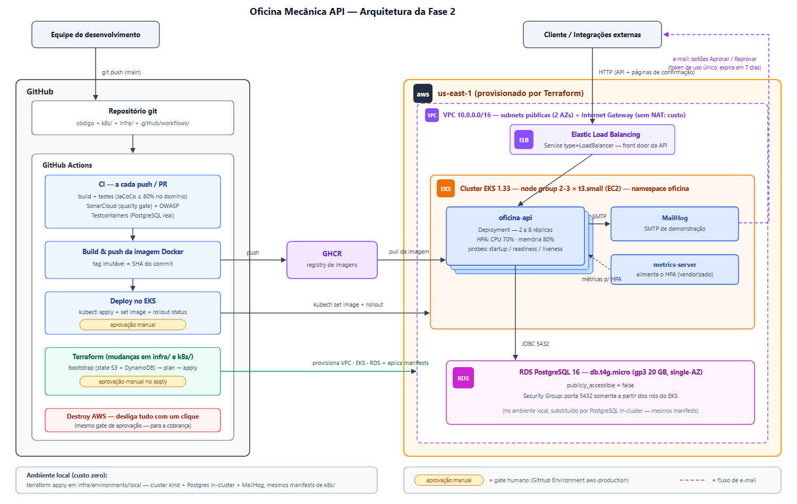

# SISTEMA INTEGRADO DE ATENDIMENTO E EXECUÇÃO DE SERVIÇOS

**PosTech FIAP — Pós-Graduação em Arquitetura de Software**
Turma SOAT — Fase 2

*Tech Challenge — Fase 2 — Documento de Entrega*

**Participantes:**

- Danilo Canato — RM 372411 — Discord: @canatodanilo
- Guilherme Fumagali Marques — RM 372421 — Discord: @gfumagali

São Paulo, julho de 2026

---

## Referências de Entrega

| Item | Link / Local |
|---|---|
| Repositório GitHub (compartilhado com `soat-architecture`) | https://github.com/Guilherme-Fumagali/tech-challenge-1 |
| Vídeo de demonstração (até 15 min) | *[LINK DO VÍDEO]* |
| Collection das APIs (Swagger UI) | `http://localhost:8080/swagger-ui.html` — *[LINK PÚBLICO DA COLLECTION]* |
| Desenho da arquitetura | *[IMAGEM/LINK DO DIAGRAMA]* (versão texto na seção 3) |
| Manifests Kubernetes | `k8s/` |
| Scripts Terraform | `infra/` (+ `infra/README.md` com recursos criados e como aplicar) |
| Pipelines CI/CD | `.github/workflows/ci-cd.yml`, `terraform.yml`, `destroy-aws.yml` |
| Documentação DDD (incl. Domain Storytelling) | `docs/ddd/` |

---

## 1. Introdução e Contexto do Problema

Após a implantação do MVP da Fase 1, a oficina mecânica ganhou eficiência no
atendimento — mas o crescimento da demanda e a expansão para novas unidades expuseram
os limites de uma aplicação executada em um único contêiner: indisponibilidade em picos,
deploy manual e nenhuma elasticidade.

O Tech Challenge Fase 2 propõe evoluir essa aplicação em duas frentes. Na frente de
negócio, completar os fluxos que ficaram em aberto no MVP: a listagem operacional de
Ordens de Serviço priorizada por status, a exclusão lógica de OS encerradas e a aprovação de
orçamento pelo próprio cliente, sem login, a partir de uma notificação real por e-mail. Na
frente de infraestrutura, tornar o sistema escalável e reprodutível: orquestração com
Kubernetes, provisionamento com Terraform (local e AWS) e pipeline de CI/CD que leva um
push na branch principal até o cluster com aprovação humana nos pontos que geram custo.

Este documento descreve as funcionalidades adicionadas, as decisões de arquitetura de
infraestrutura e as garantias de qualidade mantidas da Fase 1 — incluindo a quitação dos
débitos técnicos registrados no documento anterior.

---

## 2. Evolução da Aplicação

A base arquitetural da Fase 1 (Clean Architecture com domínio livre de framework) foi
preservada: toda funcionalidade nova nasceu como regra de domínio testada em isolamento,
orquestrada por use case e exposta por adapter — nenhuma exceção.

### 2.1 Listagem de OS ordenada por prioridade de negócio

O requisito define uma ordem de atendimento que não é cronológica nem alfabética:

> Em Execução > Aguardando Aprovação > Em Diagnóstico > Recebida — e, dentro do
> mesmo status, as mais antigas primeiro.

A ordenação é resolvida no banco, não em memória Java, via `CASE` no JPQL
(`OrdemServicoJpaRepository.findAtivasOrdenadasPorPrioridade()`):

```sql
ORDER BY CASE os.status
    WHEN 'EM_EXECUCAO'          THEN 0
    WHEN 'AGUARDANDO_APROVACAO' THEN 1
    WHEN 'EM_DIAGNOSTICO'       THEN 2
    WHEN 'RECEBIDA'             THEN 3
    ELSE 4
END, os.dataAbertura ASC
```

Resolver no banco evita carregar a tabela inteira para ordenar na aplicação — decisão
alinhada ao objetivo da fase (grandes volumes de OS em horário de pico).

**Exclusão lógica.** OS `Finalizada` e `Entregue` saem da listagem, mas nunca do banco
— o requisito veda exclusão física, e o histórico alimenta o relatório de tempo médio. A
transição de estado no domínio (`concluir()`) marca `excluidaLogicamente = true` e grava
`dataExclusaoLogica`; a query filtra por essa flag. Não existe endpoint de `DELETE` para OS.

| Endpoint | Comportamento |
|---|---|
| `GET /api/ordens` | Lista ativas, ordenadas por prioridade + antiguidade |
| `GET /api/ordens/{id}` | OS individual continua acessível mesmo após exclusão lógica |

### 2.2 Aprovação externa de orçamento via token

O requisito pede um endpoint que receba notificações externas de aprovação ou recusa
do orçamento. A solução implementada vai além de um webhook aberto: cada orçamento
gerado emite um **token de uso único por OS**, que autoriza exatamente uma decisão —
aprovar ou reprovar — sem exigir cadastro ou login do cliente.

**Propriedades do token** (`domain/valueobject/TokenAprovacaoExterna`):

| Propriedade | Implementação |
|---|---|
| Imprevisibilidade | 32 bytes de `SecureRandom`, codificados em Base64 URL-safe (43 caracteres) |
| Escopo | Um token por OS, gerado em `gerarOrcamento()` — não existe token global |
| Expiração | 7 dias (configurável por `Duration`); comparação em UTC |
| Uso único | Qualquer decisão (aprovar ou reprovar) invalida o token imediatamente |
| Validação | No agregado `OrdemServico`, não no controller — a regra vale para qualquer adapter |

**Endpoints** (públicos por decisão de negócio — a posse do token é a credencial):

| Método | Endpoint | Consumidor |
|---|---|---|
| `POST` | `/api/ordens/{id}/aprovar-externo` | Integrações (corpo JSON com token e decisão `APROVAR`/`REPROVAR`) |
| `GET` | `/api/ordens/{id}/aprovar-externo?token=...` | Botão "Aprovar" do e-mail |
| `GET` | `/api/ordens/{id}/reprovar-externo?token=...` | Botão "Reprovar" do e-mail |

Os endpoints `GET` existem por uma restrição do mundo real: um link de e-mail só
consegue fazer `GET`. É o mesmo padrão consolidado de links de *unsubscribe* — um `GET`
com efeito colateral, mitigado pelo token de uso único (um segundo clique, inclusive o
prefetch de algum cliente de e-mail, encontra o token já invalidado e recebe uma página de
erro amigável, sem efeito). Os endpoints devolvem páginas HTML de confirmação
renderizadas pelo próprio backend, para que o cliente saiba o resultado da ação sem depender
de front-end.

*[PRINT: e-mail com os botões Aprovar/Reprovar no MailHog]*

*[PRINT: página de confirmação "Orçamento aprovado!" após o clique]*

A reprovação externa reaproveita o mesmo caminho de domínio da reprovação interna:
OS `Cancelada` e **estorno de estoque na mesma transação**, exatamente como na Fase 1. A
validação do token acontece **antes** do estorno — requisição com token inválido não toca o
estoque.

### 2.3 Notificação por e-mail real (SMTP)

O Hot Spot PA2 da Fase 1 ("como notificar o cliente?") foi resolvido: o canal concreto é
e-mail. O ACL desenhado na Fase 1 absorveu a mudança sem alterar nenhum use case — o
que confirma que a fronteira estava no lugar certo:

```
application/port/NotificacaoService.java                   ← porta (inalterada desde a Fase 1)
infrastructure/notification/LogNotificacaoService.java     ← stub    (canal=log, default)
infrastructure/notification/SmtpNotificacaoService.java    ← novo    (canal=smtp)
```

`SmtpNotificacaoService` resolve o e-mail do cliente, monta uma mensagem MIME
HTML com o valor do orçamento e os dois botões de decisão, e envia via `JavaMailSender`.
A escolha do canal é uma property (`NOTIFICACAO_CANAL=smtp|log`) — trocar de canal
não é uma decisão de código.

Em desenvolvimento e demo, o SMTP é o **MailHog** (contêiner leve que captura
qualquer e-mail e o exibe numa UI web em `http://localhost:8025`), o que permite demonstrar
o fluxo completo — orçamento gerado → e-mail recebido → clique → status alterado — sem
credencial de provedor real. Em produção, bastaria apontar `SMTP_HOST`/`SMTP_PORT`
para um relay real (SES, SendGrid); nenhuma classe muda.

### 2.4 Débitos técnicos da Fase 1 — quitação

Os quatro débitos registrados no documento da Fase 1 foram endereçados:

| # | Débito (Fase 1) | Resolução (Fase 2) |
|---|---|---|
| 1 | Mappers manuais nos adapters de persistência | MapStruct nos cinco adapters (`infrastructure/persistence/mapper/`), com `unmappedTargetPolicy = ERROR`: campo novo esquecido de um lado **quebra o build** em vez de gravar `null` silenciosamente |
| 2 | Serviço de notificação stub | `SmtpNotificacaoService` (seção 2.3) |
| 3 | `fromPersistencia` com 9 parâmetros (Sonar S107) | Record `DadosOrdemServico` no domínio; `OrdemServico.reconstituir()` recebe 1 parâmetro |
| 4 | CVEs sem patch disponível | Spring Boot atualizado 3.4.5 → 3.4.7; scan OWASP reexecutado em 09/07/2026 — as mesmas 4 CVEs seguem sem patch dos fornecedores; supressões mantidas com data atualizada |

Adicionalmente, o **Domain Storytelling** — apontado como ausência na avaliação da
Fase 1 — foi produzido e está em `docs/ddd/domain_storytelling.drawio` (`.svg`),
completando o conjunto de artefatos DDD.

---

## 3. Arquitetura de Infraestrutura

### 3.1 Visão geral



```
                        ┌──────────────┐        ┌─────────────────┐
  GitHub Actions ──CI──▶│ build + test │──CD───▶│  GHCR (imagem)  │
                        └──────────────┘        └────────┬────────┘
                                                         │
                     ┌───────────────────────────────────┼──────────────────┐
                     │  Kubernetes (AWS EKS)             ▼                  │
                     │   ┌───────────────┐   ┌────────────────────┐        │
                     │   │ oficina-api   │──▶│ RDS PostgreSQL     │        │
                     │   │ (2-8 réplicas,│   │ (gerenciado)       │        │
                     │   │ HPA CPU/mem)  │   └────────────────────┘        │
                     │   └───────┬───────┘                                 │
                     │           ▼                                         │
                     │      MailHog (SMTP demo)                            │
                     └─────────────────────────────────────────────────────┘
```

O fluxo de deploy completo: push na `main` → CI (build, testes, quality gates) → imagem
Docker publicada no GHCR com a tag do SHA do commit → aprovação humana → rollout no
EKS. A infraestrutura em si (VPC, EKS, RDS) tem ciclo de vida próprio no workflow de
Terraform, com o mesmo gate de aprovação.

### 3.2 Containerização

O `Dockerfile` é multi-stage (Maven para build, JRE Alpine para runtime — imagem
final sem toolchain de compilação) e incorpora a recomendação da avaliação da Fase 1: o
contêiner **roda como usuário não-root** (`spring:spring`), com `HEALTHCHECK` apontando
para o probe de liveness do Actuator.

O `docker-compose.yml` sobe o inner-loop completo de desenvolvimento: PostgreSQL
16 (com healthcheck condicionando a subida da API), MailHog e a API. Um profile opcional
`observability` acrescenta Grafana Tempo + Grafana para inspeção de traces OpenTelemetry
— diferencial fora do escopo obrigatório. Senhas e segredos não têm default embutido no
compose: `DB_PASS` e `JWT_SECRET` ausentes derrubam a subida com mensagem explícita
(`:?defina ... no .env`).

### 3.3 Kubernetes

Os manifests em `k8s/` são os mesmos para qualquer cluster (kind local ou EKS) — a
diferença entre ambientes fica no Terraform, não nos YAMLs:

| Manifesto | Conteúdo |
|---|---|
| `namespace.yaml` | Namespace `oficina` |
| `app/deployment.yaml` | Deployment da API — sem `replicas` fixo (o HPA é o dono da contagem), probes de startup/readiness/liveness no Actuator, `requests`/`limits` de CPU e memória |
| `app/service.yaml` | Service `LoadBalancer` — front door externo da API |
| `app/configmap.yaml` | Configuração não-sensível (URL do banco, canal de notificação, SMTP) |
| `app/secret.yaml` | **Placeholder** — valores reais nunca vão para o git; em AWS quem materializa o Secret é o Terraform, a partir de secrets do GitHub |
| `app/hpa.yaml` | HorizontalPodAutoscaler: 2 a 8 réplicas, CPU 70% / memória 80% |
| `database/*` | StatefulSet PostgreSQL + Service — usado **apenas** no cluster local (na AWS o banco é RDS) |
| `mailhog/*` | Deployment + Service do MailHog |
| `metrics-server/components.yaml` | Metrics-server vendorizado — nem kind nem EKS o trazem por padrão, e o HPA depende dele |
| `loadtest/k6-script.js` | Script k6 para provocar o HPA na demonstração de escalabilidade |

Duas decisões merecem justificativa:

- **`imagePullPolicy: IfNotPresent` explícito.** Sem ele, o Kubernetes deriva `Always`
  da tag `:latest` — e `Always` continua valendo depois que o CD troca a imagem por uma tag
  imutável, o que quebraria o deploy no kind (a imagem está no nó, mas o kubelet insistiria em
  puxar de um registry).
- **HPA por CPU e memória.** O requisito pede escalonamento por consumo; usar as
  duas métricas evita o ponto cego de uma aplicação JVM que satura heap sem saturar CPU.

*[PRINT: `kubectl get hpa -w` durante o teste de carga k6, mostrando as réplicas subindo]*

### 3.4 Infraestrutura como Código — Terraform

Dois ambientes com o mesmo conjunto de manifests:

| Ambiente | Cluster | Banco | Custo | Uso |
|---|---|---|---|---|
| `infra/environments/local` | kind (Kubernetes em Docker) | PostgreSQL in-cluster | Zero | Desenvolvimento e validação |
| `infra/environments/aws` | EKS 1.33 (2× t3.small, node group 2–3) | RDS PostgreSQL 16 (db.t4g.micro, gp3 20GB) | ~US$ 0,16/h | Demo e entrega |

No ambiente AWS o Terraform provisiona **tudo do zero** em conta pessoal — VPC,
subnets públicas em duas AZs, Internet Gateway, IAM roles de cluster e nós, EKS, RDS — e,
ao final, renderiza ConfigMap/Secret com o endpoint real do RDS e aplica os manifests no
cluster. Recursos criados e instruções de aplicação estão documentados em
`infra/README.md`, como o edital exige.

Decisões de custo e segurança que valem registro:

- **Sem NAT Gateway.** Os nós ficam em subnets públicas com Security Group
  restritivo. Um NAT custa ~US$ 0,045/h só por existir; o trade-off é aceitável porque o cluster
  é efêmero — sobe para a demo, é destruído em seguida.
- **RDS fechado.** `publicly_accessible = false` e ingress na 5432 **apenas** a partir do
  Security Group dos nós do EKS — nunca `0.0.0.0/0`.
- **Backend de state fora do Terraform.** O state fica em S3 com lock em DynamoDB,
  mas esses dois recursos são criados por um script idempotente (`infra/bootstrap/bootstrap.sh`),
  não por Terraform — o primeiro `apply` que criasse o bucket precisaria guardar o próprio
  state em algum lugar que ainda não existe. Um script sem state pode rodar N vezes num
  runner efêmero e converge sempre para o mesmo resultado.
- **Acesso do pipeline via OIDC.** `infra/bootstrap/github-oidc.sh` (único passo local,
  executado uma vez) cria um OIDC provider e uma IAM role que **somente este repositório**
  consegue assumir. Não existe access key estática guardada em secret.

### 3.5 CI/CD — GitHub Actions

| Workflow | Gatilho | O que faz |
|---|---|---|
| `ci-cd.yml` | push/PR em `main` | Build + testes (JaCoCo, gate de 80% no domínio) + OWASP Dependency Check + SonarCloud com quality gate bloqueante; em push, segue para build da imagem Docker, push no GHCR (tag = SHA do commit + `latest`) e deploy no EKS com `kubectl set image` + `rollout status` |
| `terraform.yml` | mudança em `infra/**`/`k8s/**` | `bootstrap` (backend de state, idempotente) → `plan` automático (só leitura, sem custo) → `apply` **pausado aguardando aprovação humana** |
| `destroy-aws.yml` | manual | Remove o Service LoadBalancer (evita ELB órfão), destrói EKS + RDS e remove o backend de state — para a cobrança com um clique |

Todo passo que cria, altera ou destrói recurso cobrado passa pelo GitHub Environment
`aws-production` com **required reviewers**: o pipeline para e espera aprovação humana. O
deploy aplica exatamente o plano revisado (`terraform apply tfplan` do artefato gerado no
plan — não um plan novo).

*[PRINT: execução do workflow CI/CD com o gate de aprovação e o rollout no EKS]*

O pipeline atende integralmente os itens do edital: build da aplicação, execução dos
testes, build da imagem, deploy do banco (Terraform/RDS), aplicação dos manifests e deploy
no cluster.

---

## 4. APIs — Novas e Alteradas

| Método | Endpoint | Auth | Novidade na Fase 2 |
|---|---|---|---|
| `POST` | `/api/ordens` | JWT | — (Fase 1) Abertura de OS com cliente, veículo, serviços e peças; retorna UUID |
| `GET` | `/api/ordens` | JWT | **Alterado** — ordenação por prioridade de status + antiguidade; exclui OS finalizadas/entregues (exclusão lógica) |
| `GET` | `/api/ordens/{id}/status` | Pública | — (Fase 1) Consulta de status pelo cliente |
| `POST` | `/api/ordens/{id}/aprovar-externo` | Pública (token) | **Novo** — decisão externa via JSON |
| `GET` | `/api/ordens/{id}/aprovar-externo` | Pública (token) | **Novo** — botão "Aprovar" do e-mail |
| `GET` | `/api/ordens/{id}/reprovar-externo` | Pública (token) | **Novo** — botão "Reprovar" do e-mail |
| `PUT` | `/api/veiculos/{id}` | JWT | **Novo** — atualização de veículo |

O requisito "atualização de status da OS via alguma ferramenta como e-mail" é atendido
pelo trio orçamento gerado → e-mail com botões → clique altera o status (`Aguardando
Aprovação` → `Em Execução` ou `Cancelada`).

Os demais grupos de endpoints (Auth, Clientes, Veículos, Serviços, Peças, Relatório)
permanecem como na Fase 1, documentados no Swagger UI.

---

## 5. Qualidade de Software

A régua da Fase 1 foi mantida e a suíte cresceu junto com as funcionalidades:

| Camada | Tecnologia | Cobertura da Fase 2 |
|---|---|---|
| Domain | JUnit 5 puro | Token de aprovação (geração, expiração, uso único), exclusão lógica, transições |
| Application | JUnit 5 + Mockito | Use cases de aprovação/reprovação externa, listagem ordenada |
| Infrastructure | Testcontainers (PostgreSQL real) | Fluxo E2E, estorno, ordenação da listagem via API, aprovação externa por token e **cliques nos links do e-mail sem autenticação** |

**122 testes** (114 unitários e de use case + 8 de integração), todos passando. Gates
inalterados: JaCoCo falha o build abaixo de 80% de cobertura de instruções no domínio;
SonarCloud com quality gate bloqueante; OWASP Dependency Check com
`failBuildOnCVSS=9`.

O SonarCloud também deixou de reportar o S107 (método com 9 parâmetros), quitado
pelo record `DadosOrdemServico`.

---

## 6. Segurança

- **Rotas públicas são exceções deliberadas**, listadas uma a uma no `SecurityConfig`:
  consulta de status, aprovação externa (POST + os dois GETs do e-mail), auth, Swagger e
  Actuator. Todo o resto continua exigindo JWT (com a mesma rotação de refresh token e
  detecção de reuso da Fase 1).
- **Nenhum segredo no repositório**: o `k8s/app/secret.yaml` versionado contém apenas
  `REPLACE_ME`; os valores reais entram por GitHub Secrets → Terraform → Secret do
  cluster. O compose exige `.env` local.
- **Pipeline sem credencial estática**: OIDC GitHub → AWS com role restrita ao
  repositório.
- **Contêiner não-root** (feedback da Fase 1 endereçado).
- **CVEs**: reverificação completa em 09/07/2026 com Spring Boot 3.4.7 — detalhe na
  seção 2.4 e em `owasp-suppressions.xml`.

---

## 7. Débitos Técnicos Conhecidos (Fase 2)

Como na Fase 1, simplificações conscientes ficam registradas:

| # | Débito | Impacto | Solução sugerida |
|---|---|---|---|
| 1 | `MAIL_BASE_URL` fixo em `http://localhost:8080` nos ConfigMaps | Os links do e-mail assumem port-forward na demo; com o LoadBalancer como front door, apontariam para o host errado | Promover a variável Terraform preenchida com o hostname do ELB após a criação do Service |
| 2 | MailHog como SMTP | Captura e-mails, não os entrega a caixas reais — adequado à demo, não à produção | Trocar `SMTP_HOST`/`SMTP_PORT` por um relay real (SES/SendGrid); nenhuma classe muda |
| 3 | Perfil único de acesso (Admin) | RBAC Atendente/Mecânico segue não implementado (Hot Spot PA4 da Fase 1) | Roles no JWT + `@PreAuthorize` por perfil |
| 4 | Nós do EKS em subnets públicas | Trade-off deliberado de custo (sem NAT Gateway) aceitável só porque o cluster é efêmero | NAT Gateway + subnets privadas num ambiente permanente |

---

## 8. Conclusão

A Fase 2 transformou o MVP da Fase 1 em um sistema implantável, escalável e
reprodutível de ponta a ponta. As funcionalidades pedidas pelo edital — listagem priorizada
com exclusão lógica, aprovação externa de orçamento e atualização de status via e-mail —
foram implementadas como extensões naturais do domínio existente, o que validou na prática
as fronteiras desenhadas na Fase 1: o ACL de notificação recebeu seu canal concreto e o
agregado `OrdemServico` absorveu token de aprovação e exclusão lógica sem que nenhum
use case anterior fosse reescrito.

Na infraestrutura, a mesma aplicação roda em três alvos com artefatos idênticos —
Docker Compose no inner-loop, kind com custo zero e EKS + RDS na AWS — provisionados
por Terraform e operados inteiramente pelo GitHub Actions, com aprovação humana
obrigatória em qualquer passo que crie custo e destruição completa com um clique. A
escalabilidade dinâmica exigida é demonstrável: HPA de 2 a 8 réplicas reagindo a carga
gerada por k6.

A régua de qualidade não cedeu à pressa da fase: 122 testes, cobertura de domínio
travada em 80% no build, quality gate SonarCloud bloqueante, OWASP a cada push e os
quatro débitos técnicos da Fase 1 quitados — incluindo o Domain Storytelling apontado na
avaliação anterior.

---

## 9. Referências Bibliográficas

EVANS, E. *Domain-Driven Design: Tackling Complexity in the Heart of Software.* Boston:
Addison-Wesley, 2003.

VERNON, V. *Implementing Domain-Driven Design.* Boston: Addison-Wesley, 2013.

BURNS, B.; BEDA, J.; HIGHTOWER, K. *Kubernetes: Up and Running.* 3. ed. Sebastopol:
O'Reilly, 2022.

HASHICORP. *Terraform Documentation.* Disponível em: https://developer.hashicorp.com/terraform/docs.
Acesso em: julho 2026.

KUBERNETES. *Horizontal Pod Autoscaling.* Disponível em:
https://kubernetes.io/docs/tasks/run-application/horizontal-pod-autoscale/. Acesso em: julho 2026.

AMAZON WEB SERVICES. *Amazon EKS User Guide.* Disponível em:
https://docs.aws.amazon.com/eks/latest/userguide/. Acesso em: julho 2026.

OWASP Foundation. *OWASP Dependency-Check.* Disponível em:
https://owasp.org/www-project-dependency-check/. Acesso em: julho 2026.
