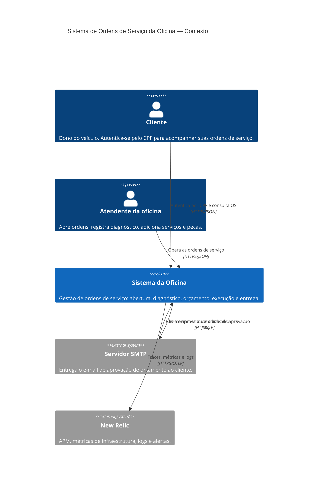

# C4 · Nível 1 — Contexto

Quem usa o sistema e com que sistemas externos ele conversa.

**Ponto que costuma passar despercebido:** a aprovação de orçamento é um fluxo de **volta** — o cliente clica num link do e-mail e o sistema recebe a chamada de fora, autenticada por um token de uso único, não pelo JWT de CPF.
