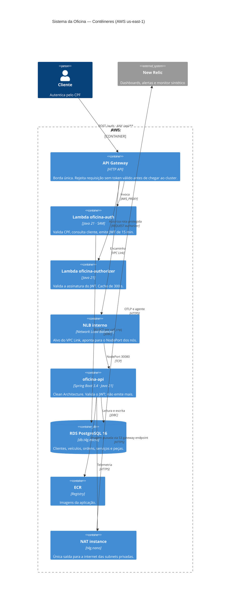

# C4 · Nível 2 — Contêineres

Atende o requisito de **diagrama de componentes com visão de nuvem, APIs, banco e monitoramento**.

## Fronteiras de rede

| Zona | O que hospeda |
|---|---|
| Internet | API Gateway (gerenciado pela AWS) |
| Subnet **pública** | NAT instance apenas |
| Subnet **privada** | nós do EKS, RDS, NLB interno, Lambda de autenticação |

Nenhum nó ou banco tem IP público. A única saída é pela NAT instance, e a única entrada é pelo API Gateway.
