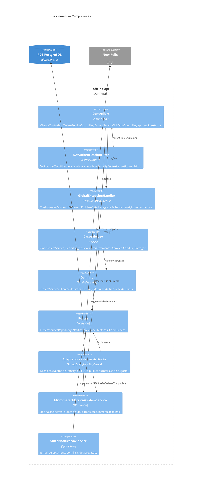

# C4 · Nível 3 — Componentes da aplicação

Arquitetura interna do contêiner `oficina-api`, em Clean Architecture.

## A decisão que sustenta as métricas de negócio

Os três dashboards exigidos precisam de métricas que o agente de APM não conhece — ele entrega latência e erro HTTP, mas não sabe o que é uma ordem de serviço.

A alternativa óbvia seria injetar `MeterRegistry` em cada caso de uso, mudando **nove construtores** e o `UseCaseConfig`. Em vez disso:

1. `OrdemServico` acumula eventos `TransicaoOS` num método único de transição, que já valida a mudança de status e mede a permanência no status anterior.
2. O adaptador de persistência **drena** esses eventos em `salvar()` — o funil por onde toda transição passa.

O resultado é que a métrica descreve **evento de negócio**, não requisição HTTP: se amanhã a OS for aberta por outro canal, a contagem continua correta. E o domínio não conhece Micrometer.
