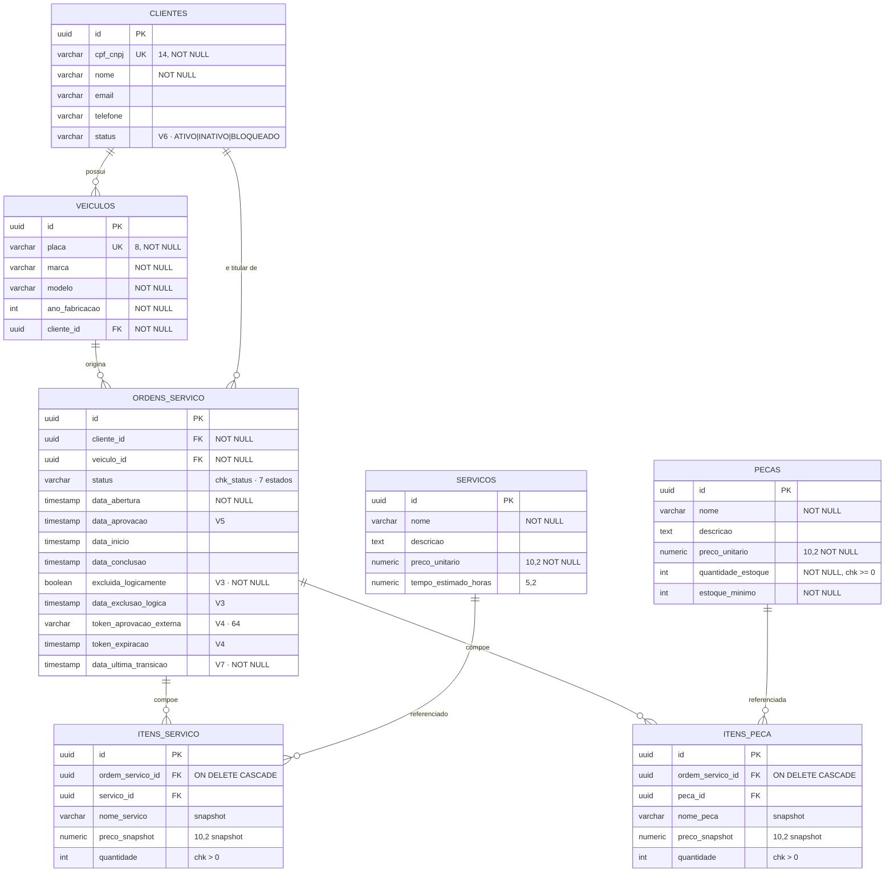

# Modelo relacional — DER e explicação dos relacionamentos

Atende a exigência literal do enunciado: *"justificativa formal para a escolha do banco de dados e ajustes no modelo relacional, com diagramas ER e explicação dos relacionamentos"*.

A justificativa da escolha do engine está em [RFC-002](../rfcs/RFC-002-escolha-do-banco.md) e [ADR-010](../adrs/ADR-010-postgresql-rds.md). Este documento cobre o **modelo** e os **relacionamentos**.

## Diagrama

## Explicação dos relacionamentos

### `CLIENTES` 1—N `VEICULOS`

Um cliente possui zero ou mais veículos; todo veículo pertence a exatamente um cliente. `veiculos.cliente_id` é obrigatório — **não existe veículo órfão** no modelo. `placa` é única globalmente, não por cliente: a mesma placa não pode ser cadastrada duas vezes mesmo em titularidades diferentes.

### `VEICULOS` 1—N `ORDENS_SERVICO` e `CLIENTES` 1—N `ORDENS_SERVICO`

A OS carrega **duas** chaves estrangeiras: cliente e veículo. É uma desnormalização deliberada, já que o cliente poderia ser derivado do veículo.

A razão é histórica e de integridade: o titular do veículo pode mudar, e a OS precisa preservar **quem era o cliente no momento da abertura**. Sem `ordens_servico.cliente_id`, uma transferência de titularidade reescreveria o histórico de todas as ordens antigas.

O caso de uso valida a coerência na abertura — se o veículo não pertence ao cliente informado, a OS é recusada.

### `ORDENS_SERVICO` 1—N `ITENS_SERVICO` / `ITENS_PECA`

Composição, não agregação: os itens **não existem sem a OS**, o que o `ON DELETE CASCADE` reflete. É a fronteira do agregado `OrdemServico` no domínio.

### `SERVICOS` 1—N `ITENS_SERVICO` e `PECAS` 1—N `ITENS_PECA`

Relacionamento N—N entre OS e catálogo, resolvido pelas tabelas de itens — que não são meras tabelas de junção, porque carregam atributos próprios: quantidade e **snapshot de preço**.

### O padrão de snapshot

`itens_servico` e `itens_peca` guardam `nome_*` e `preco_snapshot` **duplicados** do catálogo.

Não é redundância acidental: um orçamento aprovado precisa continuar valendo o que valia quando foi aprovado. Se o preço da peça subir depois, a OS já fechada não pode mudar de valor retroativamente. A FK para o catálogo permanece para rastreabilidade; o valor cobrado vem do snapshot.

## Ajustes desta fase

| Migration | Mudança | Motivo |
|---|---|---|
| **V6** | `clientes.status` + `chk_cliente_status` | Requisito direto: a Lambda consulta "a existência **e o status**" do cliente. `DEFAULT 'ATIVO'` garante que os registros existentes continuem autenticando após o deploy |
| **V6** | `idx_clientes_cpf_status` | Consulta executada a cada autenticação |
| **V6** | `idx_os_status_abertura` | Sustenta a listagem por prioridade de negócio e as agregações dos dashboards |
| **V7** | `ordens_servico.data_ultima_transicao` | Sem ela não há como medir permanência por status. As datas existentes — abertura, início, conclusão — cobrem só parte da máquina de estados |

O backfill da V7 usa `COALESCE(data_conclusao, data_inicio, data_abertura)`: a melhor aproximação disponível para ordens antigas, antes de tornar a coluna `NOT NULL`.

## Invariantes protegidas no banco

Constraints como segunda linha de defesa das regras de domínio — se um caminho de escrita escapar da aplicação, o banco ainda recusa:

| Constraint | Protege |
|---|---|
| `chk_status` | Os 7 estados válidos da OS, espelhando o enum `StatusOS` |
| `chk_cliente_status` | Os 3 estados de situação cadastral |
| `chk_estoque_nao_negativo` | Estoque de peça nunca negativo |
| `chk_qtd_servico` / `chk_qtd_peca` | Quantidade sempre positiva |
| `UNIQUE(cpf_cnpj)` / `UNIQUE(placa)` | Sem cliente ou veículo duplicado |

## Débito conhecido

A tabela `refresh_tokens`, criada na `V2`, ficou **órfã** com a migração da emissão de token para a Lambda. Não foi derrubada: a remoção é irreversível sem backup e não traz ganho funcional. Registrada em [`debitos-tecnicos.md`](../debitos-tecnicos.md).
