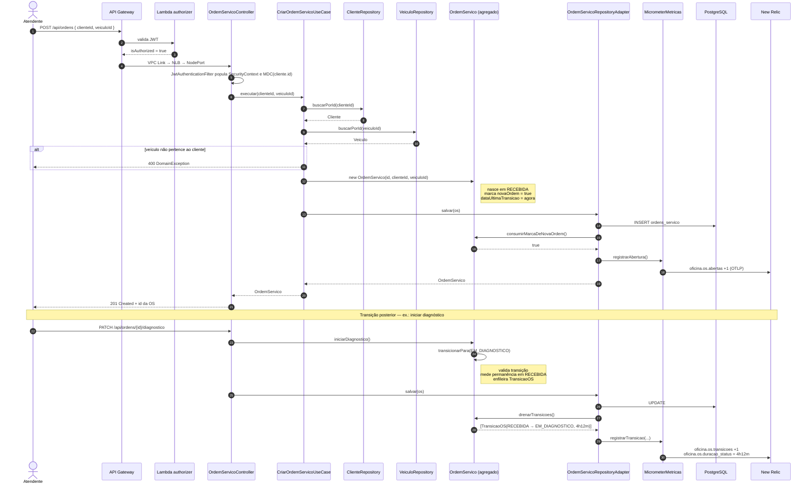

# Diagrama de sequência — Abertura de ordem de serviço

Requisito literal do enunciado. Mostra o caminho completo, incluindo a emissão das métricas de negócio.

## Por que o adaptador publica a métrica

Toda transição termina em `repository.salvar(os)` — é o funil natural. Instrumentar ali evita injetar dependência de métrica em nove casos de uso, e mantém o domínio sem conhecer Micrometer.

O agregado acumula os eventos; a fronteira de persistência os drena e publica. É evento de domínio na versão mínima, sem barramento nem publisher.
