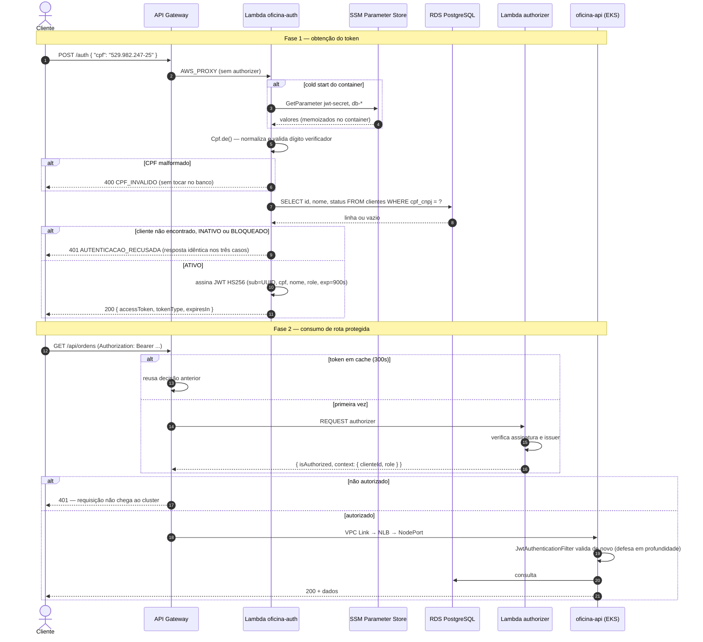

# Diagrama de sequência — Autenticação por CPF

Requisito literal do enunciado.

## Três detalhes que o diagrama torna explícitos

**CPF sem cadastro e cadastro sem permissão recebem a mesma resposta.** O status, os cabeçalhos e o corpo são idênticos, e o motivo fica apenas no log. Assim, o endpoint não permite descobrir quais CPFs estão cadastrados.

**O `sub` é o UUID do cliente.** O CPF não é usado como identificador, para não ser registrado nos logs das requisições seguintes.

**A validação acontece duas vezes.** O authorizer valida o token no gateway, e o filtro da aplicação valida novamente. A autorização sobre cada recurso, como verificar se a OS pertence ao cliente, é feita pela aplicação.
