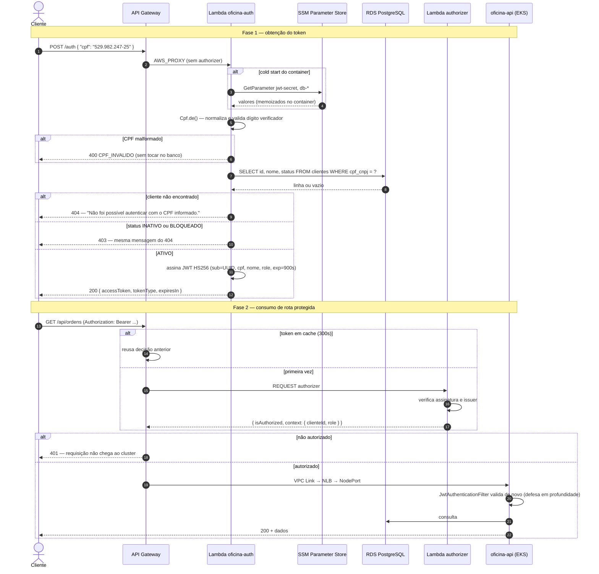

# Diagrama de sequência — Autenticação por CPF

Requisito literal do enunciado.

## Três detalhes que o diagrama torna explícitos

**404 e 403 devolvem a mesma mensagem.** O código específico existe para o log; o corpo é genérico de propósito, para que ninguém use o endpoint para descobrir quais CPFs existem na base.

**O `sub` é o UUID, não o CPF.** Assim o identificador não se espalha pelos logs de todo request downstream.

**A validação acontece duas vezes.** No gateway, pelo authorizer, que é o ponto de aplicação; e na aplicação, pelo filtro, que é a rede de segurança. O gateway autentica; quem decide se *este* cliente pode ver *esta* OS continua sendo a aplicação.
