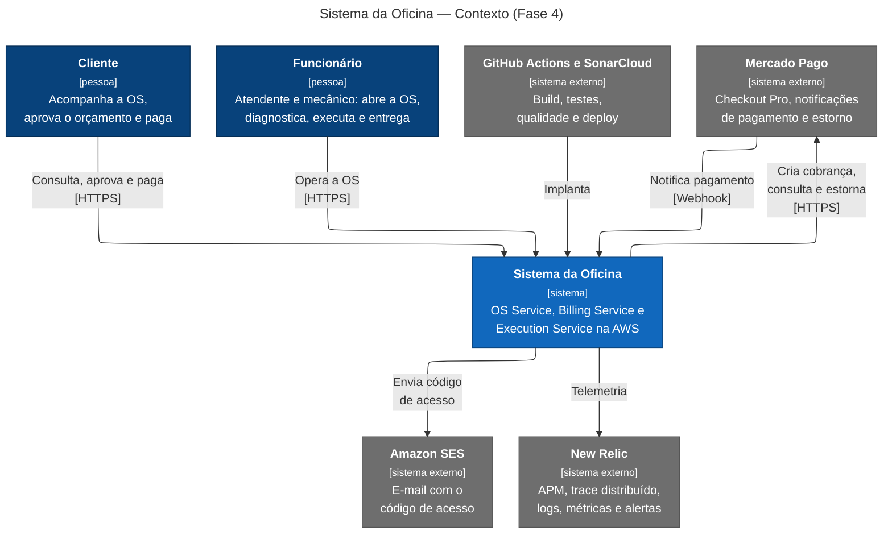

# C4 · Nível 1 — Contexto

Visão do sistema da oficina e dos sistemas externos com que se relaciona na Fase 4.

```mermaid
---
title: Sistema da Oficina — Contexto (Fase 4)
config:
  layout: elk
  flowchart:
    padding: 12
    wrappingWidth: 320
    nodeSpacing: 40
    rankSpacing: 70
---
flowchart TB
    cliente["<b>Cliente</b><br/><small>[pessoa]</small><br/>Acompanha a OS,<br/>aprova o orçamento e paga"]
    funcionario["<b>Funcionário</b><br/><small>[pessoa]</small><br/>Atendente e mecânico: abre a OS,<br/>diagnostica, executa e entrega"]
    gh["<b>GitHub Actions e SonarCloud</b><br/><small>[sistema externo]</small><br/>Build, testes,<br/>qualidade e deploy"]
    oficina["<b>Sistema da Oficina</b><br/><small>[sistema]</small><br/>OS Service, Billing Service e<br/>Execution Service na AWS"]
    mp["<b>Mercado Pago</b><br/><small>[sistema externo]</small><br/>Checkout Pro, notificações<br/>de pagamento e estorno"]
    ses["<b>Amazon SES</b><br/><small>[sistema externo]</small><br/>E-mail com o<br/>código de acesso"]
    nr["<b>New Relic</b><br/><small>[sistema externo]</small><br/>APM, trace distribuído,<br/>logs, métricas e alertas"]

    cliente -->|"Consulta, aprova e paga<br/>[HTTPS]"| oficina
    funcionario -->|"Opera a OS<br/>[HTTPS]"| oficina
    gh -->|Implanta| oficina
    oficina -->|"Cria cobrança,<br/>consulta e estorna<br/>[HTTPS]"| mp
    mp -->|"Notifica pagamento<br/>[Webhook]"| oficina
    oficina -->|"Envia código<br/>de acesso"| ses
    oficina -->|Telemetria| nr

    classDef pessoa fill:#08427b,stroke:#052e56,color:#ffffff
    classDef sistema fill:#1168bd,stroke:#0b4884,color:#ffffff
    classDef externo fill:#6e6e6e,stroke:#555555,color:#ffffff
    class cliente,funcionario pessoa
    class oficina sistema
    class gh,mp,ses,nr externo
```
