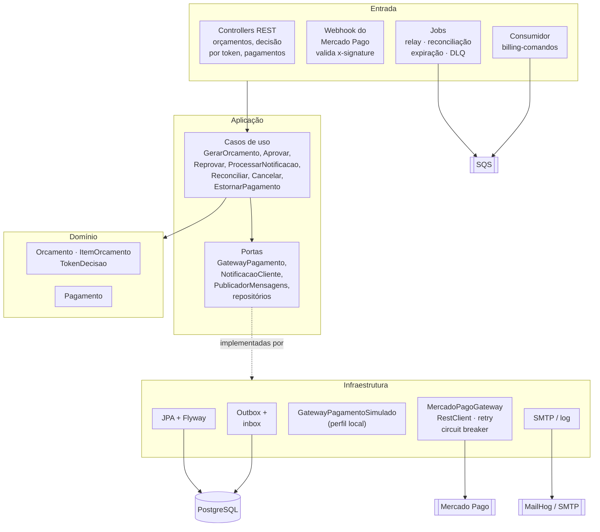

# C4 · Nível 3 — Billing Service

```mermaid
---
config:
  flowchart:
    nodeSpacing: 26
    rankSpacing: 74
    wrappingWidth: 400
    padding: 10
---
flowchart TB
    subgraph web["Entrada"]
        ctl["Controllers REST<br/>orçamentos, decisão<br/>por token, pagamentos"]
        wh["Webhook do<br/>Mercado Pago<br/>valida x-signature"]
        lst["Consumidor<br/>billing-comandos"]
        jobs["Jobs<br/>relay · reconciliação<br/>expiração · DLQ"]
    end
    subgraph app["Aplicação"]
        uc["Casos de uso<br/>GerarOrcamento, Aprovar,<br/>Reprovar, ProcessarNotificacao,<br/>Reconciliar, Cancelar,<br/>EstornarPagamento"]
        portas["Portas<br/>GatewayPagamento,<br/>NotificacaoCliente,<br/>PublicadorMensagens,<br/>repositórios"]
    end
    subgraph dom["Domínio"]
        direction LR
        orc["Orcamento · ItemOrcamento<br/>TokenDecisao"]
        pag["Pagamento"]
    end
    subgraph infra["Infraestrutura"]
        out["Outbox +<br/>inbox"]
        jpa["JPA + Flyway"]
        sim["GatewayPagamentoSimulado<br/>(perfil local)"]
        mpg["MercadoPagoGateway<br/>RestClient · retry<br/>circuit breaker"]
        smtp["SMTP / log"]
    end
    db[("PostgreSQL")]
    mp[["Mercado Pago"]]
    mail[["MailHog / SMTP"]]
    sqs[["SQS"]]
    web --> uc
    uc --> dom
    uc --> portas
    portas -. implementadas por .-> infra
    mpg --> mp
    smtp --> mail
    jpa --> db
    out --> db
    jobs --> sqs
    lst --> sqs
```
