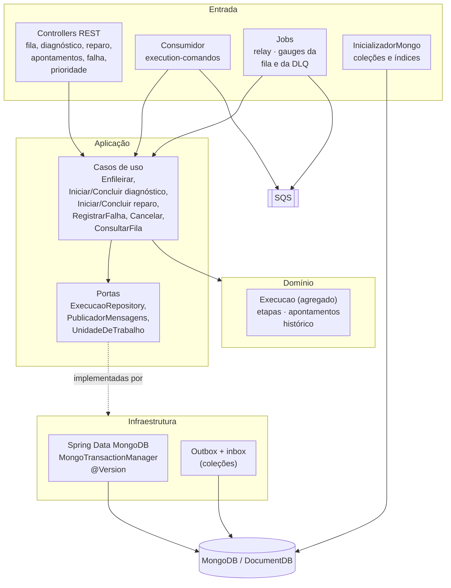

# C4 · Nível 3 — Execution Service

```mermaid
---
config:
  flowchart:
    nodeSpacing: 26
    rankSpacing: 74
    wrappingWidth: 400
    padding: 10
---
flowchart TB
    subgraph web["Entrada"]
        ctl["Controllers REST<br/>fila, diagnóstico, reparo,<br/>apontamentos, falha,<br/>prioridade"]
        lst["Consumidor<br/>execution-comandos"]
        jobs["Jobs<br/>relay · gauges da<br/>fila e da DLQ"]
        init["InicializadorMongo<br/>coleções e índices"]
    end
    subgraph app["Aplicação"]
        uc["Casos de uso<br/>Enfileirar,<br/>Iniciar/Concluir diagnóstico,<br/>Iniciar/Concluir reparo,<br/>RegistrarFalha, Cancelar,<br/>ConsultarFila"]
        portas["Portas<br/>ExecucaoRepository,<br/>PublicadorMensagens,<br/>UnidadeDeTrabalho"]
    end
    subgraph dom["Domínio"]
        exe["Execucao (agregado)<br/>etapas · apontamentos<br/>histórico"]
    end
    subgraph infra["Infraestrutura"]
        mongo["Spring Data MongoDB<br/>MongoTransactionManager<br/>@Version"]
        out["Outbox + inbox<br/>(coleções)"]
    end
    db[("MongoDB / DocumentDB")]
    sqs[["SQS"]]

    ctl --> uc
    lst --> uc
    jobs --> uc
    lst --> sqs
    jobs --> sqs
    init --> db
    uc --> dom
    uc --> portas
    portas -. implementadas por .-> infra
    mongo --> db
    out --> db
```
