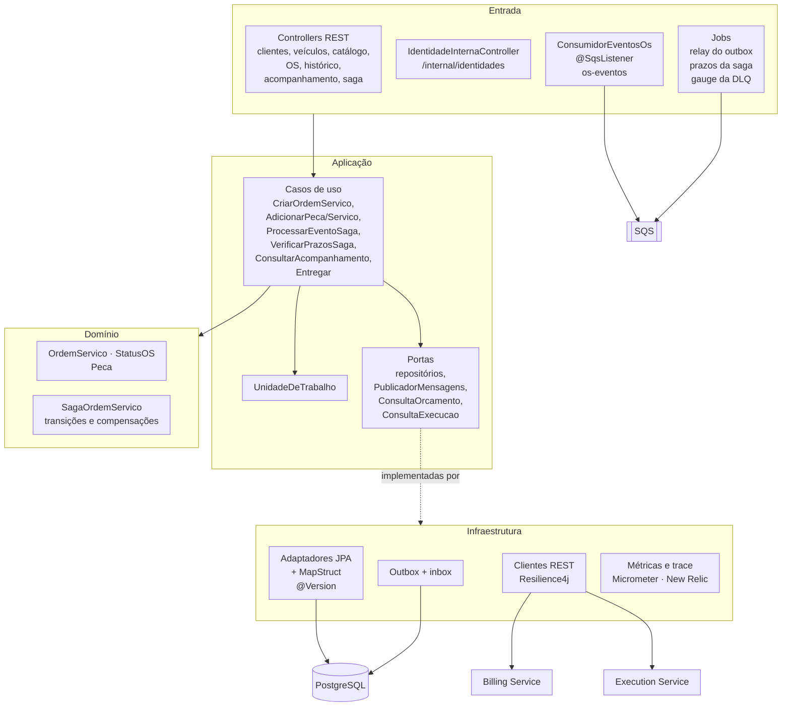

# C4 · Nível 3 — OS Service

```mermaid
---
config:
  flowchart:
    nodeSpacing: 26
    rankSpacing: 74
    wrappingWidth: 400
    padding: 10
---
flowchart TB
    subgraph web["Entrada"]
        ctl["Controllers REST<br/>clientes, veículos, catálogo,<br/>OS, histórico,<br/>acompanhamento, saga"]
        intc["IdentidadeInternaController<br/>/internal/identidades"]
        lst["ConsumidorEventosOs<br/>@SqsListener<br/>os-eventos"]
        jobs["Jobs<br/>relay do outbox<br/>prazos da saga<br/>gauge da DLQ"]
    end
    subgraph app["Aplicação"]
        uc["Casos de uso<br/>CriarOrdemServico,<br/>AdicionarPeca/Servico,<br/>ProcessarEventoSaga,<br/>VerificarPrazosSaga,<br/>ConsultarAcompanhamento,<br/>Entregar"]
        uow["UnidadeDeTrabalho"]
        portas["Portas<br/>repositórios,<br/>PublicadorMensagens,<br/>ConsultaOrcamento,<br/>ConsultaExecucao"]
    end
    subgraph dom["Domínio"]
        direction LR
        os["OrdemServico · StatusOS<br/>Peca"]
        saga["SagaOrdemServico<br/>transições e compensações"]
    end
    subgraph infra["Infraestrutura"]
        out["Outbox + inbox"]
        jpa["Adaptadores JPA<br/>+ MapStruct<br/>@Version"]
        rest["Clientes REST<br/>Resilience4j"]
        nr["Métricas e trace<br/>Micrometer · New Relic"]
    end
    db[("PostgreSQL")]
    bil["Billing Service"]
    exe["Execution Service"]
    sqs[["SQS"]]

    web --> uc
    lst --> sqs
    jobs --> sqs
    uc --> dom
    uc --> uow
    uc --> portas
    portas -. implementadas por .-> infra
    jpa --> db
    out --> db
    rest --> bil
    rest --> exe
```
