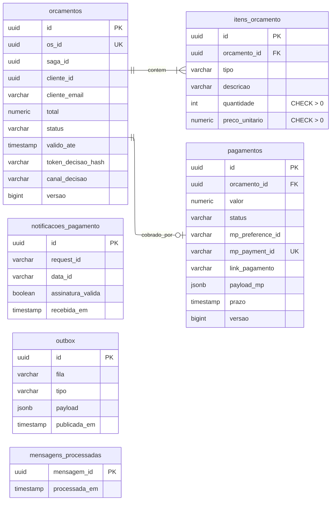

# DER — banco do Billing Service (PostgreSQL)

`os_id`, `cliente_id` e `saga_id` são identificadores recebidos nas mensagens; não há chave estrangeira para outro serviço.

```mermaid
---
config:
  layout: elk
---
erDiagram
    direction LR
    orcamentos ||--|{ itens_orcamento : contem
    orcamentos ||--o| pagamentos : cobrado_por

    orcamentos {
        uuid id PK
        uuid os_id UK
        uuid saga_id
        uuid cliente_id
        varchar cliente_email
        numeric total
        varchar status
        timestamp valido_ate
        varchar token_decisao_hash
        varchar canal_decisao
        bigint versao
    }
    itens_orcamento {
        uuid id PK
        uuid orcamento_id FK
        varchar tipo
        varchar descricao
        int quantidade "CHECK > 0"
        numeric preco_unitario "CHECK > 0"
    }
    pagamentos {
        uuid id PK
        uuid orcamento_id FK
        numeric valor
        varchar status
        varchar mp_preference_id
        varchar mp_payment_id UK
        varchar link_pagamento
        jsonb payload_mp
        timestamp prazo
        bigint versao
    }
    notificacoes_pagamento {
        uuid id PK
        varchar request_id
        varchar data_id
        boolean assinatura_valida
        timestamp recebida_em
    }
    outbox {
        uuid id PK
        varchar fila
        varchar tipo
        jsonb payload
        timestamp publicada_em
    }
    mensagens_processadas {
        uuid mensagem_id PK
        timestamp processada_em
    }
```
