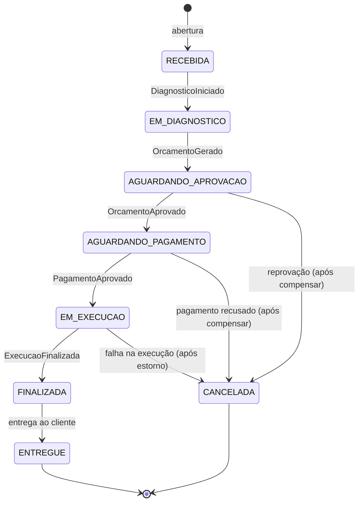

# Status da ordem de serviço

`AGUARDANDO_PAGAMENTO` é novo na Fase 4. As transições, exceto a entrega, são disparadas pelos eventos da saga.

```mermaid
stateDiagram-v2
    [*] --> RECEBIDA: abertura
    RECEBIDA --> EM_DIAGNOSTICO: DiagnosticoIniciado
    EM_DIAGNOSTICO --> AGUARDANDO_APROVACAO: OrcamentoGerado
    AGUARDANDO_APROVACAO --> AGUARDANDO_PAGAMENTO: OrcamentoAprovado
    AGUARDANDO_APROVACAO --> CANCELADA: reprovação (após compensar)
    AGUARDANDO_PAGAMENTO --> EM_EXECUCAO: PagamentoAprovado
    AGUARDANDO_PAGAMENTO --> CANCELADA: pagamento recusado (após compensar)
    EM_EXECUCAO --> FINALIZADA: ExecucaoFinalizada
    EM_EXECUCAO --> CANCELADA: falha na execução (após estorno)
    FINALIZADA --> ENTREGUE: entrega ao cliente
    ENTREGUE --> [*]
    CANCELADA --> [*]
```
