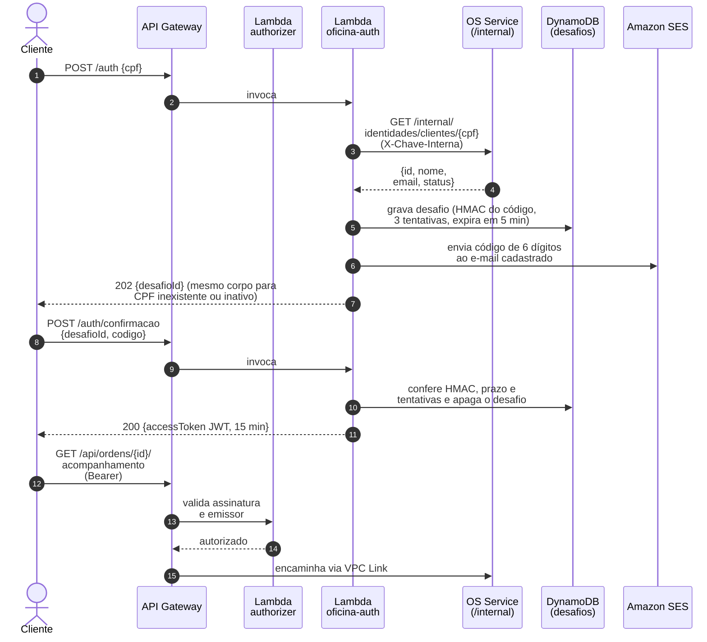

# Sequência — autenticação com segundo fator

O Lambda não acessa banco de outro serviço: a identidade vem do OS Service por um endpoint interno, e o desafio fica em uma tabela própria.

```mermaid
---
config:
  sequence:
    wrap: false
    diagramMarginX: 12
    diagramMarginY: 10
    width: 90
    actorMargin: 30
    messageMargin: 34
    boxMargin: 8
    noteMargin: 12
    messageFontSize: 15
    noteFontSize: 14
    actorFontSize: 15
  themeVariables:
    noteBkgColor: "#f4f4f4"
    noteTextColor: "#222222"
    noteBorderColor: "#9a9a9a"
---
sequenceDiagram
    autonumber
    actor C as Cliente
    participant GW as API Gateway
    participant Z as Lambda<br/>authorizer
    participant L as Lambda<br/>oficina-auth
    participant OS as OS Service<br/>(/internal)
    participant D as DynamoDB<br/>(desafios)
    participant S as Amazon SES

    C->>GW: POST /auth {cpf}
    GW->>L: invoca
    L->>OS: GET /internal/<br/>identidades/clientes/{cpf}<br/>(X-Chave-Interna)
    OS-->>L: {id, nome,<br/>email, status}
    L->>D: grava desafio (HMAC do código,<br/>3 tentativas, expira em 5 min)
    L->>S: envia código de 6 dígitos<br/>ao e-mail cadastrado
    L-->>C: 202 {desafioId} (mesmo corpo para<br/>CPF inexistente ou inativo)
    C->>GW: POST /auth/confirmacao<br/>{desafioId, codigo}
    GW->>L: invoca
    L->>D: confere HMAC, prazo e<br/>tentativas e apaga o desafio
    L-->>C: 200 {accessToken JWT, 15 min}
    C->>GW: GET /api/ordens/{id}/<br/>acompanhamento<br/>(Bearer)
    GW->>Z: valida assinatura<br/>e emissor
    Z-->>GW: autorizado
    GW->>OS: encaminha via VPC Link
```
