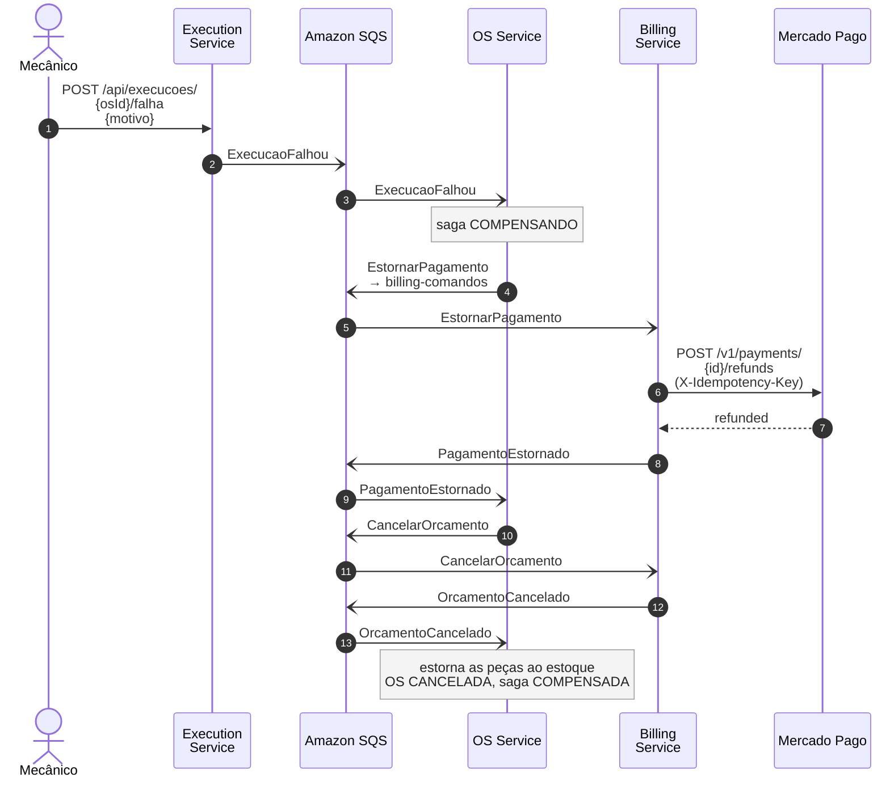

# Sequência — compensação por falha na execução

Depois do pagamento aprovado, desfazer exige estorno no Mercado Pago.

```mermaid
---
config:
  sequence:
    wrap: false
    diagramMarginX: 12
    diagramMarginY: 10
    width: 90
    actorMargin: 30
    messageMargin: 34
    boxMargin: 8
    noteMargin: 12
    messageFontSize: 15
    noteFontSize: 14
    actorFontSize: 15
  themeVariables:
    noteBkgColor: "#f4f4f4"
    noteTextColor: "#222222"
    noteBorderColor: "#9a9a9a"
---
sequenceDiagram
    autonumber
    actor M as Mecânico
    participant EX as Execution<br/>Service
    participant Q as Amazon SQS
    participant OS as OS Service
    participant BI as Billing<br/>Service
    participant MP as Mercado Pago

    M->>EX: POST /api/execucoes/<br/>{osId}/falha<br/>{motivo}
    EX-)Q: ExecucaoFalhou
    Q-)OS: ExecucaoFalhou
    Note over OS: saga COMPENSANDO
    OS-)Q: EstornarPagamento<br/>→ billing-comandos
    Q-)BI: EstornarPagamento
    BI->>MP: POST /v1/payments/<br/>{id}/refunds<br/>(X-Idempotency-Key)
    MP-->>BI: refunded
    BI-)Q: PagamentoEstornado
    Q-)OS: PagamentoEstornado
    OS-)Q: CancelarOrcamento
    Q-)BI: CancelarOrcamento
    BI-)Q: OrcamentoCancelado
    Q-)OS: OrcamentoCancelado
    Note over OS: estorna as peças ao estoque<br/>OS CANCELADA, saga COMPENSADA
```
