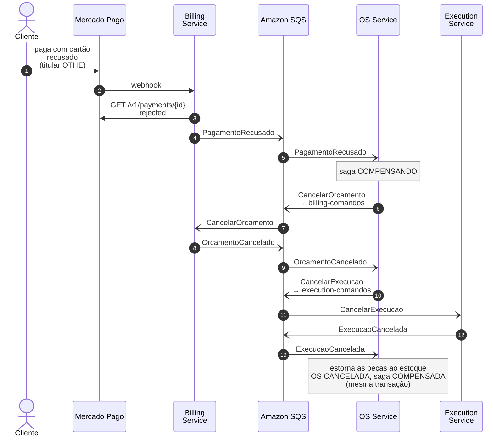

# Sequência — compensação por pagamento recusado

Ordem *pessimistic view* (aula 3 de SAGA): primeiro o que impede trabalho novo, por último o que devolve recurso.

```mermaid
---
config:
  sequence:
    wrap: false
    diagramMarginX: 12
    diagramMarginY: 10
    width: 90
    actorMargin: 30
    messageMargin: 34
    boxMargin: 8
    noteMargin: 12
    messageFontSize: 15
    noteFontSize: 14
    actorFontSize: 15
  themeVariables:
    noteBkgColor: "#f4f4f4"
    noteTextColor: "#222222"
    noteBorderColor: "#9a9a9a"
---
sequenceDiagram
    autonumber
    actor C as Cliente
    participant MP as Mercado Pago
    participant BI as Billing<br/>Service
    participant Q as Amazon SQS
    participant OS as OS Service
    participant EX as Execution<br/>Service

    C->>MP: paga com cartão<br/>recusado<br/>(titular OTHE)
    MP->>BI: webhook
    BI->>MP: GET /v1/payments/{id}<br/>→ rejected
    BI-)Q: PagamentoRecusado
    Q-)OS: PagamentoRecusado
    Note over OS: saga COMPENSANDO
    OS-)Q: CancelarOrcamento<br/>→ billing-comandos
    Q-)BI: CancelarOrcamento
    BI-)Q: OrcamentoCancelado
    Q-)OS: OrcamentoCancelado
    OS-)Q: CancelarExecucao<br/>→ execution-comandos
    Q-)EX: CancelarExecucao
    EX-)Q: ExecucaoCancelada
    Q-)OS: ExecucaoCancelada
    Note over OS: estorna as peças ao estoque<br/>OS CANCELADA, saga COMPENSADA<br/>(mesma transação)
```
